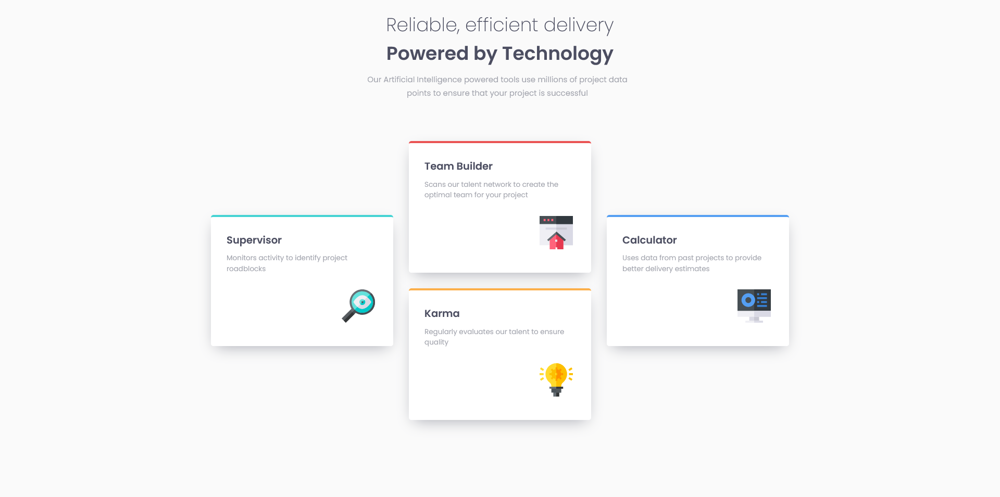

# Frontend Mentor - Four card feature section solution

This is a solution to the [Four card feature section challenge on Frontend Mentor](https://www.frontendmentor.io/challenges/four-card-feature-section-weK1eFYK). 
## Table of contents

- [Overview](#overview)
  - [The challenge](#the-challenge)
  - [Screenshot](#screenshot)
  - [Links](#links)
- [My process](#my-process)
  - [Built with](#built-with)
- [Author](#author)

## Overview

### The challenge

Users should be able to:

- View the optimal layout for the site depending on their device's screen size

### Screenshot

### Links

- Solution URL: [Click](https://www.frontendmentor.io/solutions/four-card-preview-mobile-first-workflow-Nv8INei6CT)
- Live Site URL: [Click](https://jwalczak94.github.io/Four-card-feature-section/)

## My process

### Built with
- VSCode
- Semantic HTML5 markup
- CSS custom properties
- Mobile-first workflow

## Author

- Website - [J.Walczak](https://github.com/jwalczak94)
- Frontend Mentor - [@jwalczak94](https://www.frontendmentor.io/profile/jwalczak94)